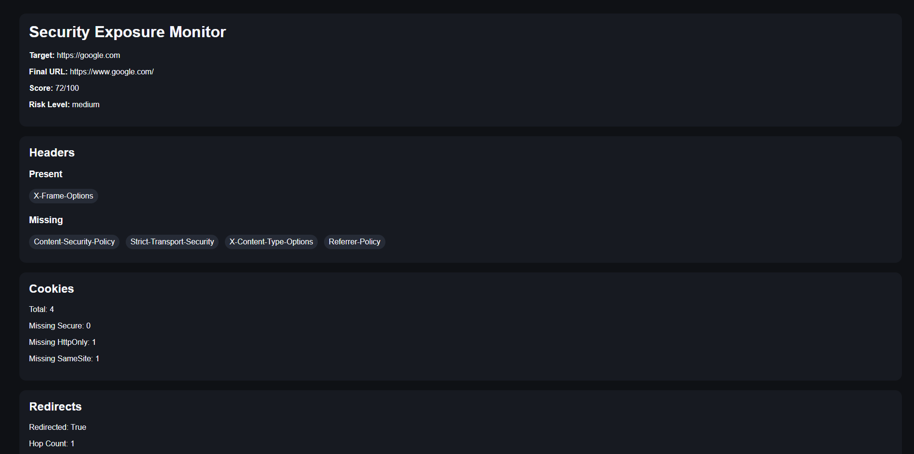

# Security Exposure Monitor

Security Exposure Monitor is a defensive Python tool that analyzes the web exposure posture of domains you own or are authorized to test.  
It performs several security checks against a target website and generates structured reports that summarize potential risks and configuration issues.

The tool focuses on identifying common security misconfigurations related to HTTP headers, cookies, TLS configuration, redirects, and publicly exposed resources.

---

## Features

- HTTP security headers analysis
- Cookie security analysis (Secure / HttpOnly / SameSite)
- robots.txt discovery and parsing
- sitemap.xml detection
- redirect chain analysis
- HTTP → HTTPS detection
- TLS / HTTPS inspection
- risk scoring system
- JSON report generation
- HTML dashboard report

---

## Project Structure

security-exposure-monitor
│
├── app
│ ├── main.py
│ ├── scanner.py
│ ├── headers_audit.py
│ ├── cookies_audit.py
│ ├── redirects_audit.py
│ ├── tls_checks.py
│ ├── robots_audit.py
│ ├── sitemap_audit.py
│ ├── scoring.py
│ ├── storage.py
│ └── utils.py
│
├── templates
│ └── dashboard.html.j2
│
├── outputs
│
├── tests
│
├── requirements.txt
├── README.md
└── .gitignore

---

## Installation

Clone the repository:
git clone https://github.com/YOUR_USERNAME/security-exposure-monitor.git

cd security-exposure-monitor

Install dependencies:
pip install -r requirements.txt

---

## Usage

Run a scan against a target domain:
python -m app.main example.com

Example:

python -m app.main google.com

---

## Output

After a scan completes, the tool generates reports inside the `outputs` directory.

outputs/
├── report.json
└── report.html

The JSON report contains structured data from the scan, while the HTML report provides a visual dashboard summarizing the results.

---

## Security Checks Performed

### HTTP Security Headers

The tool checks for important security headers such as:

- Content-Security-Policy
- Strict-Transport-Security
- X-Frame-Options
- X-Content-Type-Options
- Referrer-Policy

Missing headers may indicate weaker protection against attacks like XSS, clickjacking, or MIME sniffing.

---

### Cookie Security

Cookies are analyzed to determine whether important security attributes are present:

- Secure
- HttpOnly
- SameSite

Cookies missing these attributes may expose sessions to attacks such as cross-site scripting or cross-site request forgery.

---

### Redirect Analysis

The tool analyzes redirect chains and identifies:

- number of redirects
- redirect destinations
- HTTP → HTTPS upgrade

This helps detect insecure redirect behavior.

---

### robots.txt Analysis

The tool checks whether a `robots.txt` file exists and extracts:

- disallowed paths
- sitemap references

Although robots.txt is not a security mechanism, it may reveal sensitive paths.

---

### Sitemap Detection

The scanner checks whether a sitemap is publicly available at: /sitemap.xml

---

### TLS Inspection

The tool inspects the TLS configuration of the target server and reports:

- TLS version
- certificate issuer

---

## Risk Scoring

The tool calculates a simple exposure score based on detected issues.

Score ranges:

- **80 – 100** → Low risk
- **50 – 79** → Medium risk
- **0 – 49** → High risk

The score is influenced by:

- missing security headers
- insecure cookie attributes
- redirect behavior
- missing public configuration files

---

## Example Output (Terminal)
Scan finished

Target: https://google.com

Final URL: https://www.google.com

Score: 82
Risk level: low
---

## Legal Notice

This tool is intended only for systems you own or have explicit authorization to test.

Unauthorized scanning of third-party systems may violate laws, service terms, or acceptable use policies.

Use responsibly.

---

## Future Improvements

Possible future improvements include:

- scanning multiple domains from file input
- scan history with SQLite storage
- improved risk scoring model
- richer HTML dashboard
- technology fingerprinting
- API endpoint discovery
- CI integration for automated scans

---
## Dashboard Preview

## Author

Computer Science student focused on software engineering, backend development, and security tooling.

This project is part of a personal portfolio demonstrating practical experience with Python, networking, and security analysis.
